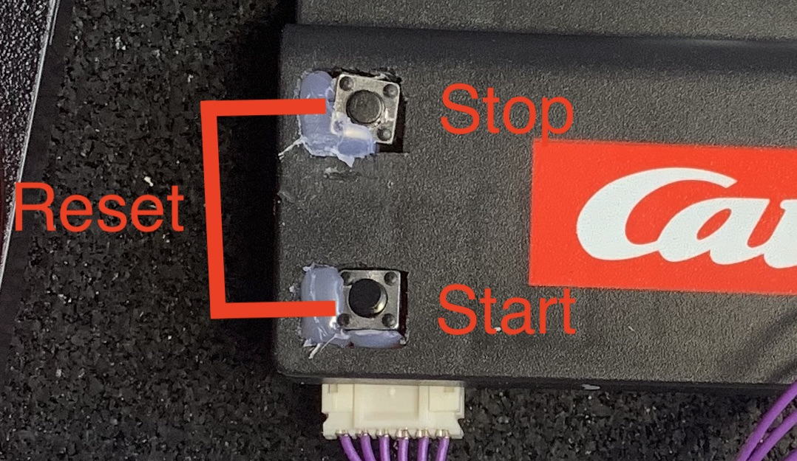

# Race Track Demo with StreamSets

## The Raspberry Pi

### setup
The electronic schemat and code for the Raspberry Pi can be found in this repo: [abruneau/hacking_electric_race_track](https://github.com/abruneau/hacking_electric_race_track)

The Raspberry pi is running Raspbian. To conserve resources, I disabled the gui and ennabled ssh. You can follow [this guide](https://www.digikey.com/en/maker/blogs/2018/how-to-boot-to-command-line-and-ssh-on-raspberry-pi).

### Install SDC edge:

```bash
cd /op/local

wget https://archives.streamsets.com/datacollector/3.13.0/tarball/SDCe/streamsets-datacollector-edge-3.13.0-linux-arm.tgz

tar xf streamsets-datacollector-edge-3.13.0-linux-arm.tgz

bin/edge -service install
bin/edge -service start
```

## Running the demo

### Setup

1. Turn on the Raspberry Pi
2. Execute the `start.sh` script on the Raspberry Pi
3. In `docker-compose.yml` update kafka service ADV_HOST with your IP
4. Start all the components on the main machine by running `docker-compose up -d`. The first time it might take a few minutes to download all the docker images and build them.
5. All SDC pipelines should start exept one (DO NOT start it)
6. In the `read race` edge pipeline, update kafka destination with your IP address, and the ip address of the Raspberry Pi

| Service | Address | User | Password |
|---------|---------|------|----------|
| SDC | http://localhost:18630 | admin | admin |
| Transformer | http://localhost:19630 | admin | admin |
| Lenses (kafka) | http://localhost:3030 | admin | admin |
| Dashboard | http://localhost | | |

### Start Racing
To start a new race, on the dasboard, go to the `new_race` 

  
Fill the informations in (only a name is required). Once you submitted the form, you will be redirected to the race dashboard. Once you are ready to start, press the start button to start the race.

The physical buttons allow you to start a new race, stop a none finished race and reset a race. If the start button is pressed again, a new race is started with the same players.



**Start Button**: Initiate a new race. If the current game already has a finish time (no new game was created), will start a new game with the same players.

**Stop Button**: End a race before all laps are done.

**Reset Buttons**: Reset the current Game

